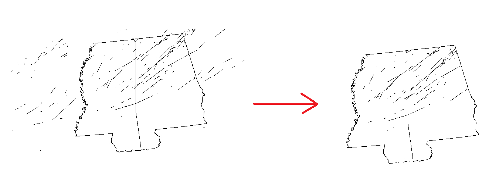

```{r setup, include=FALSE}
knitr::opts_chunk$set(echo = TRUE)
```

# Exercise 1 - Import shapefiles

1. Based on what you've learned, add the shapefile named "NC_Hurricanes" (found in the data folder) in R.

2. What type of feature is this shapefile?  Points, lines, or polygons?

3. How many hurricanes have hit any part of North Carolina since 1842?  

4. Plot the hurricanes by themselves using the plot() function.  Then add the United States shapefile in the background.
```{r, message=F, warning=F, echo=FALSE}
library(rgdal)
states <- readOGR(dsn = "data\\UnitedStates.shp", layer = "UnitedStates", verbose = FALSE)
NC_Hurricanes <- readOGR(dsn = "data/NC_Hurricanes.shp", layer = "NC_Hurricanes", verbose = FALSE)

#Add the states
plot(states)
#Add hurricanes
lines(NC_Hurricanes, col = "Red")
```

# Exercise 2 - charts and leaflet

1. Make a bar chart of hurricane wind speeds using the wmo_wind field.

2. Add the hurricane shapefile to leaflet.

```{r, message = F, warning = F, echo=FALSE}
library(leaflet)

NC_Hurricanes <- readOGR(dsn = "data/NC_Hurricanes.shp", layer = "NC_Hurricanes", verbose = FALSE)

leaflet() %>% addTiles() %>% addPolylines(data = NC_Hurricanes, col = "red")
```

3. In the leaflet map, only display hurricanes that have occured since 2000 and add a popup that displays the name (hint: field is called "Name.")

```{r, echo=FALSE}
NC_Hurricanes <- readOGR(dsn = "data/NC_Hurricanes.shp", layer = "NC_Hurricanes", verbose = FALSE)

Hurricanes_2000 <- subset(NC_Hurricanes, NC_Hurricanes@data$year >2000)

leaflet() %>% addTiles() %>% addPolylines(data = Hurricanes_2000, col = "red", popup = ~paste("Hurricane Name: ", Name))

```


4. Change the basemap to "MtbMap"

```{r, echo=FALSE}

leaflet() %>% addProviderTiles("MtbMap") %>% addPolylines(data = Hurricanes_2000, col = "red", popup = ~paste("Hurricane Name: ", Name))

```

# Exercise 3 - RQGIS

1. Import the shapefiles called "MS_AL" and "April2011pr".  Based on what you've learned, find the QGIS tool called intersection and set the tools parameters.  Since we've already set up the environment settings, you can go directly to importing the shapefiles and seting the tools parameters.


2. What you want to do is clip the nationwide line shapefile to just Mississippi and Alabama and plot both maps and save the clipped line shapefile to a new shapefile (note: this will automatically occur if you set up the tools settings properly).


 ```{r, fig.retina=NULL, out.width=650, echo=FALSE} 
  
 ``` 
